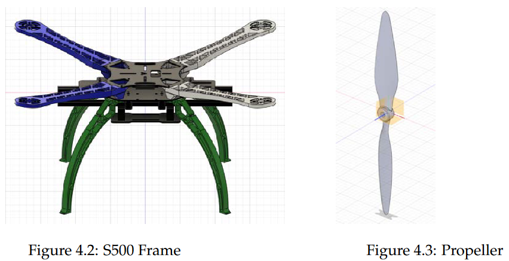
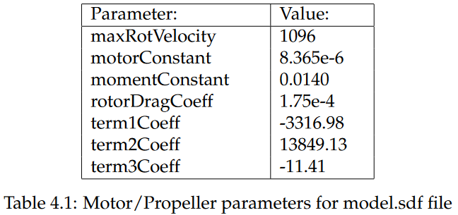
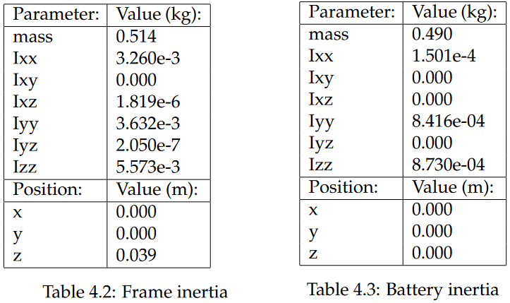
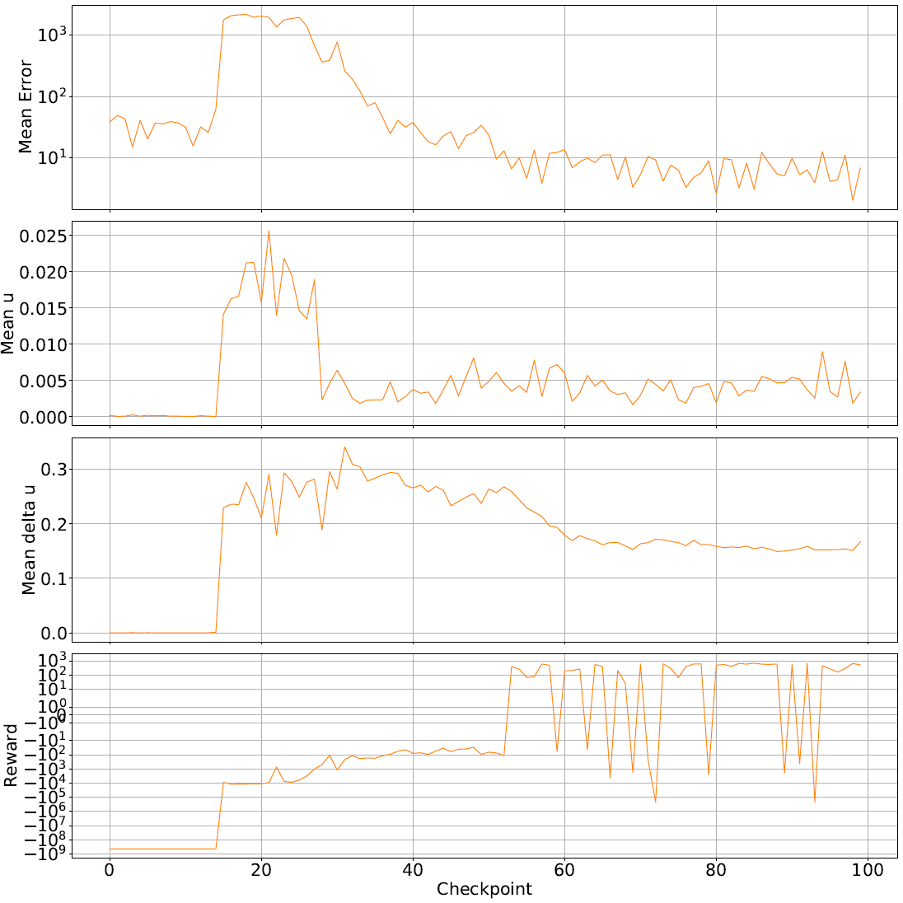
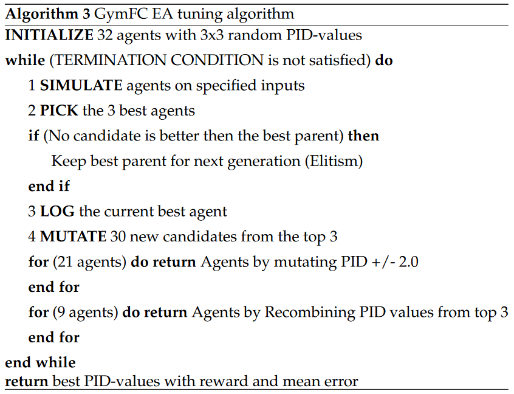
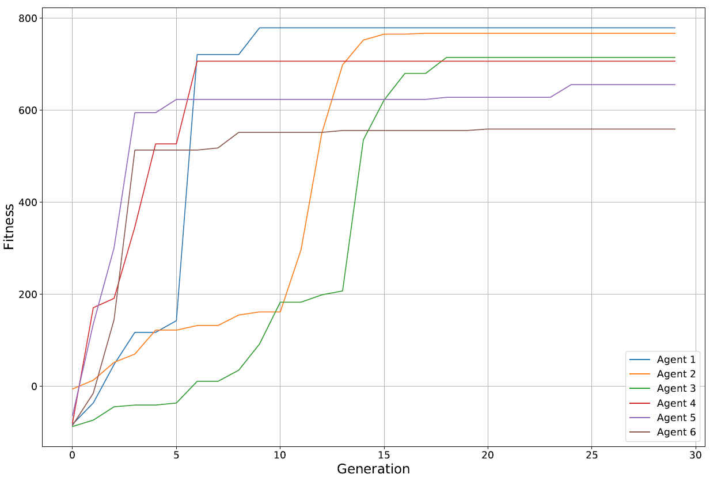
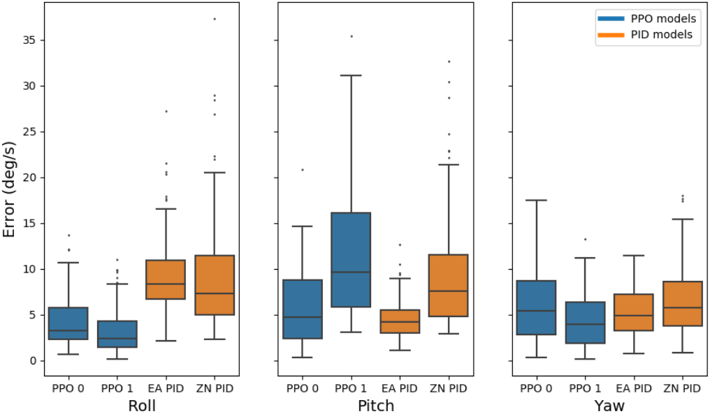
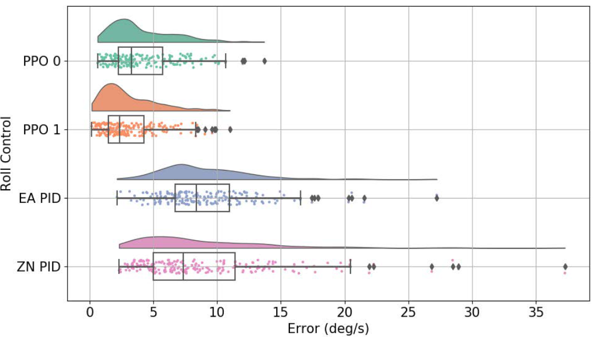
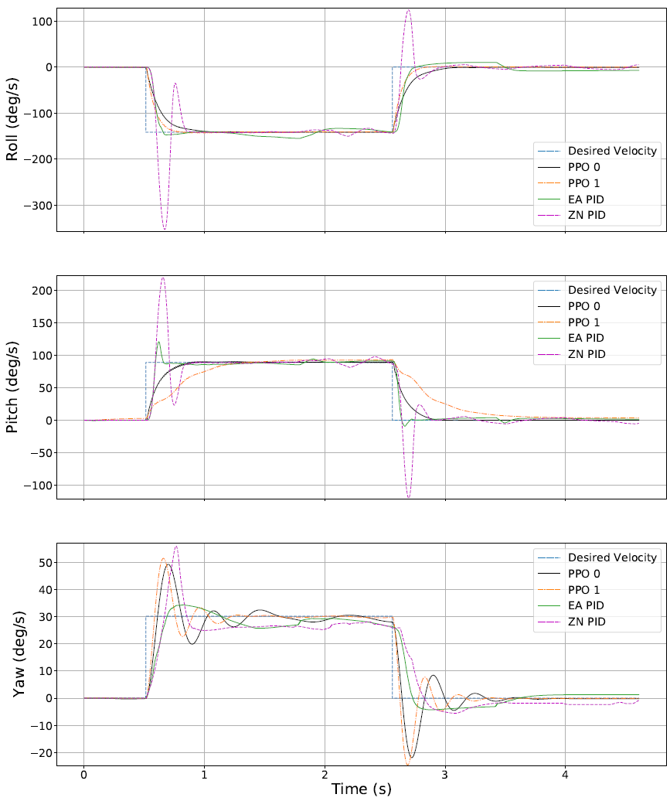
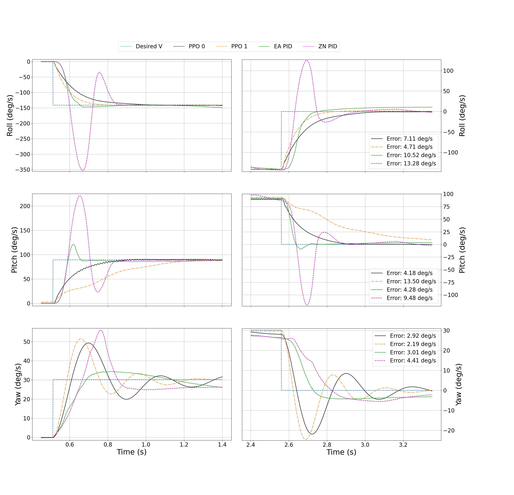

# Attitude Control with Reinforcement Learning on aerial vehicles

### TLDR

## Problem statement
- We'll explore the use of RL as a control system for attitude control, analysing its potential, stability, reliability and time of development, to see if it is a viable option.
- The new controller will be compared to the classical PID controller and develope a genetically inspired optimization algorithm, to see if there is more potential in the PID method and strenghten the comparison, since PID is only as good as tuning setup.

### Method: gymfc and modeling
- GymFC is a open source flight control tuner, not just for neural network based controllers. It is built around having a digital twin of your vehicle, this is to ensure a seemless transition to hardware. It has a high fidelity simulation environment based on gazebo and uses the PX4 gazebo SITL plugin for motor modeling.
- You start out by modeling the rigid body of the UAV. This being the main components of the aircraft. When designing a quadrotor, this being the battery, motors, propellers, frame and flight controller. In this thesis, the CAD file for frame and propellers were found online and imported into cad software. The rest were modeled by myself, since these had a very simple shape. From here one can scale the mass-density of each part to equal the measured weight. Then one can extract the inertia matrix. The values from one motor is shown. Then the forces from the motor/propeller combination is calculated based on the equations shown earlier. These equations needs specific force, torque and moment constants that can be found in the UIUC Propeller Database, researched by University of Illinois. 
The other graph is showing motor response of pwm output, the resulting polynomial function is inserted into the vehicle configuration file, together with the forces and moments that were calculated.

Calculated motor response:

Parameters used for the motor and propeller:

Inertia parameters for the frame and battery:

### Method: training of rl model
- The hyperparamters was first tested on the example vehicle given in the GymFC repository, which showed to work well, to the hyperparameters were left as is. PPO is known to not needing that much tuning of hyperparameters.
- The most important part of training a RL model is the reward functions. Obviously in our scenario, we want to learn a quadrotor to how to fly or train its attitude controller. By having it minimize the error on each axis from a given setpoint of angular velocity.
Just learning it how to minimize the error is not enough to make it fly well, we also want to teach it how to fly reliably and steady.
- The simulation environment that the agent is learning in, is based on that it is given a random set of setpoint, which are angular velocities for each axis. Then the agent will try to reach these angular velocities at the same time.
The vehicle is in a zero gravity environment, where it float in the air and spins around its axis.
To make the vehicle hover in the real world, a minimum throttle output is built into the mixing of the vehicle.
So the training environment is solely focusing on the attitude control aspect.

Training data of the PPO Reinforcement Learning model:

### Method: Evolutionary Algorithm
- Implementing the EA into GymFC for tuning PID controller. 
    32 individuals, with 9 random float values ranging 2-70. This was determined from testing the lowest Proportional value that would make any noticable change in the attitude. 21 agents are generated from mutating their gain values by a random float between -2,2 and 9 agents are generated by recombining the pid values from the top 3 of the last generation.
- for fitness function, the same functions used in RL is used. This is to make sure that we get an unbiased comparison, where both models value the same behaviour, and we can more clearly study the behaviour of the controllers.

## Experiments and results

### Box plot from Monte Carlo simulation results (200 simulations). 

Showing error in rotational velocity for roll, pitch and yaw.

### A closer look at the results for roll, this time showing a rain cloud plot:

### A response graph showcasing 4 different controllers:
- 2 Reinforcement Learning trained models using the PPO algorithms
- Evolutionary Algorithm trained PID model
- Ziegler Nichols tuned PID model

### A closer look of the same response graph as above:

